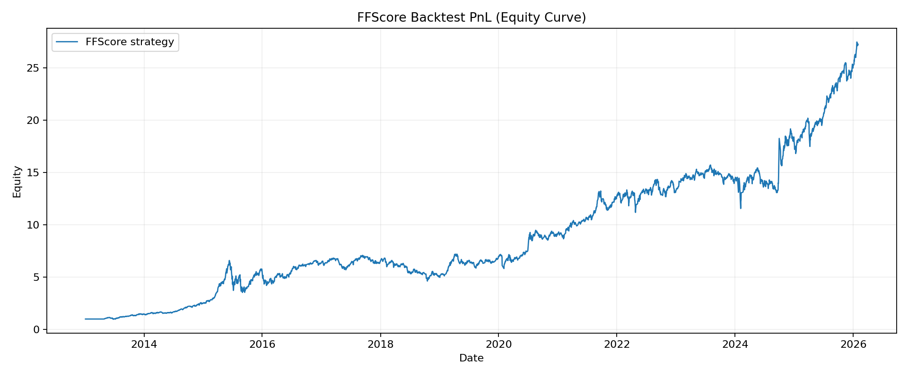
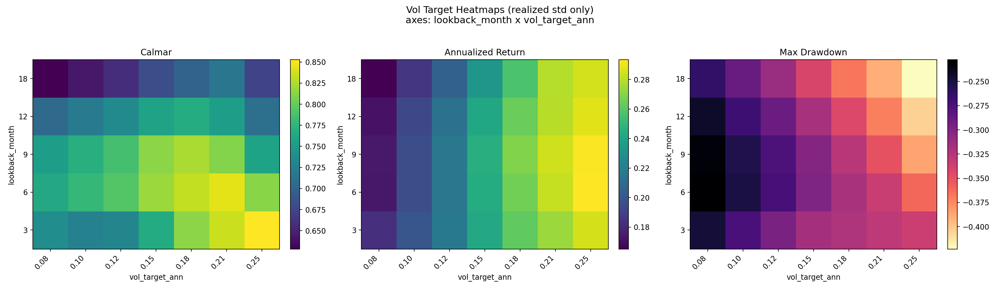

# Reproduction of FFScore and Drawdown Control

This repository reproduces the FFScore strategy and studies whether volatility targeting can reduce its drawdown while preserving reasonable return.

## Motivation

Why quantamental:

- It combines fundamentals with systematic execution.
- Capacity is generally larger and signal decay is usually slower than many high-frequency or pure technical signals. A significant part of expected return comes from compensation for bearing risk (company management, marco downside, ...).

## Setup
FFScore is a practical adaptation of Piotroski-style accounting quality signals to the Chinese A-share universe.

### Data

TuShare, which is more affordable compared to other Chinese market API.

### Signal construction

Monthly FFScore is built from 5 binary components:

1. `ROE > 0`
2. `delta_roe > 0` (year-over-year)
3. `delta_caturn > 0` (current-asset turnover improvement)
4. `delta_turn > 0` (total-asset turnover improvement)
5. `delta_lever > 0` (deleveraging)

The score ranges from 0 to 5.

### Portfolio and execution assumptions

- The stock universe is the A share stocks whose OHLCV and fundamental data can be found from TuShare.
- Long-only.
- Default selection in this repo:
  - low-PB filter enabled (`pb_quantile = 0.2`)
  - full-score-only enabled (buy names with `FFScore >= 5`)
- Stocks with monthly tradable days below threshold are removed from portfolio in the next month (`force_cash`).
- Signal timing: signal is formed after month-end close; trading happens on the next trading day.
- Rebalance frequency default: monthly.
- Transaction cost: one-way cost in bps (`cost-bps = 10`) applied through turnover.
- Daily PnL engine with weight drift and daily equity compounding.

### Risk-control extension

Volatility targeting uses realized volatility estimated from daily strategy net returns:

- Lookback window: `vol_lookback_m` months (converted to trading days).
- Annualized volatility estimate: `std(daily_net_ret) * sqrt(252)`.
- Leverage scaling: `vol_target_ann / vol_est_ann`, capped by `max_leverage`.

## Results

Main backtest outputs are in `reports/ffscore_backtest_final/`.

From `performance_summary.csv` and `rank_ic_summary.csv`:

- Annualized return: **29.96%**
- Annualized volatility: **26.97%**
- Sharpe: **1.11**
- Rank IC: **0.0256**
- Total return: **2621.89%**
- Max drawdown: **-46.35%**

These results suggest the FFScore + low-PB + full-score framework has strong long-run return, but still experiences deep drawdowns.

### FFScore PnL (Equity Curve)

## Reduction of Drawdown

### Volatility memory observation

Using `reports/ffscore_backtest_final/strategy_vol_lag_correlation.csv`:

- 1-month-lag correlation of realized vol: **0.65**
- 2-month-lag correlation: **0.47**
- 3-month-lag correlation: **0.31**

This indicates short-horizon volatility clustering (memory), which motivates dynamic risk scaling.

### Vol-target grid test

I ran a grid over:

- `lookback_m` in `{3, 6, 9, 12, 18}`
- `vol_target_ann` in `{0.08, 0.10, 0.12, 0.15, 0.18, 0.21, 0.25}`
- fixed `max_leverage = 1.0`

See:

- Heatmaps: `reports/voltarget_heatmaps.png`
- Raw grid metrics: `reports/voltarget_heatmaps.csv`

### Vol-target Heatmaps

Key findings:

- **Drawdown can be materially reduced** versus baseline max drawdown (-46.35%).
- Best Calmar point in tested grid: about **0.841** (`lookback=6`, `vol_target=0.25`), with annualized return ~29.13% and max drawdown ~-34.64%.

Overall, volatility targeting provides a controllable return-vs-drawdown trade-off, and is effective as a risk overlay for this FFScore strategy.